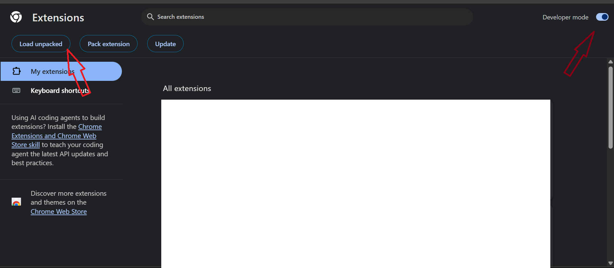

# YouTube Ads Remover

Simple browser extension that skips YouTube ads by adding `&t=1`.

## Features

* Auto skip ads
* No login
* No subscription
* Simple to use

## Installation

1. Download the file, add this two background.js - manifest.json in any one folder.
2. Open **Extensions → Developer Mode**  url-"chrome://extensions/".
3. Click **Load unpacked**.
4. Select the extension folder.
5. Open YouTube and enjoy.

## Screenshot

## Disclaimer

This is a simple personal/educational extension. YouTube changes may affect how it
works.